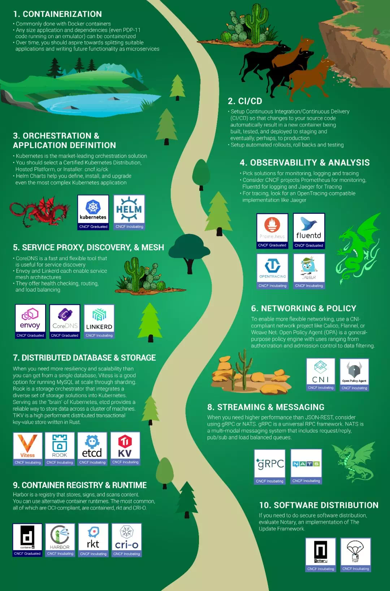
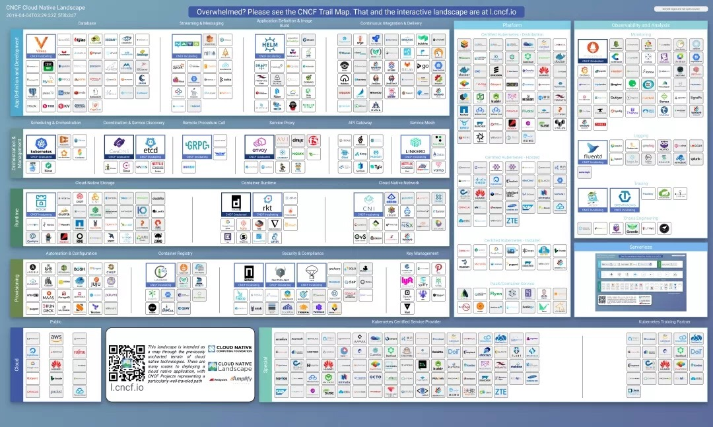

# 初识
朋友介绍文档:

istio.io
- https://istio.io/docs/

对应github官方文档:
https://istio.io

书籍：
先学习《Kubernetes权威指南：从Docker到Kubernetes实践全接触》，跟吴志辉交流了下，只是写了部分。

再学习：《Istio入门与实战》,作者毛广献。

https://github.com/mgxian/istio-lab  
https://github.com/cloudnativebooks/cloud-native-istio

# istio是什么？
[istio是什么？](https://istio.io/zh/docs/concepts/what-is-istio/)

## 什么是服务网格？
services mesh:通常用于描述构成这些应用程序的微服务**网络和应用之间的交互**。随着规模和复杂性增长，越来越难以理解和管理。包括服务发现、负载均衡、故障恢复、指标收集和监控以及更复杂的运维需求，如A/B测试、金丝雀发布、限流、访问控制、端到端限流等。
istio 提供了一个完整解决方案，通过为整个服务网格提供行为洞察和操作控制来满足服务应用程序的多样化需求。

## 为什么要使用istio？
istio提供一种简单的方式为已部署的服务建立网络，该网络具有负载均衡、服务间认证、监控等功能。只需要一点改动，部署一个sidecar代理，使用istio控制平面功能配置和管理代理，拦截微服务之间所有的网络通信。

- HTTP、gRPC、websocket、tcp流量的自动负载均衡
- 
