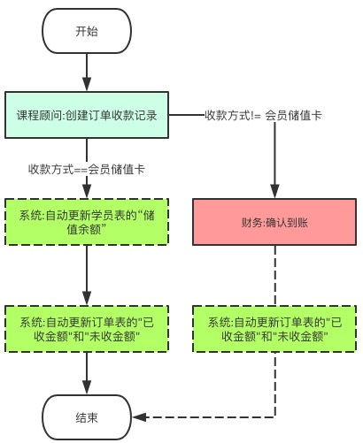
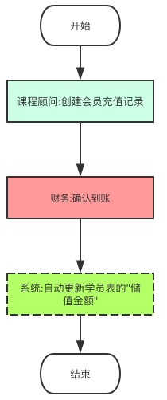
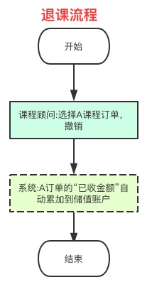

- [案例:订单系统](#%E6%A1%88%E4%BE%8B%E8%AE%A2%E5%8D%95%E7%B3%BB%E7%BB%9F)
  - [业务流程图](#%E4%B8%9A%E5%8A%A1%E6%B5%81%E7%A8%8B%E5%9B%BE)
    - [学员录入、订单、付款完整流程](#%E5%AD%A6%E5%91%98%E5%BD%95%E5%85%A5%E8%AE%A2%E5%8D%95%E4%BB%98%E6%AC%BE%E5%AE%8C%E6%95%B4%E6%B5%81%E7%A8%8B)
    - [订单付款流程](#%E8%AE%A2%E5%8D%95%E4%BB%98%E6%AC%BE%E6%B5%81%E7%A8%8B)
    - [储值卡充值流程](#%E5%82%A8%E5%80%BC%E5%8D%A1%E5%85%85%E5%80%BC%E6%B5%81%E7%A8%8B)
    - [退课流程](#%E9%80%80%E8%AF%BE%E6%B5%81%E7%A8%8B)
    - [换课流程](#%E6%8D%A2%E8%AF%BE%E6%B5%81%E7%A8%8B)
    - [退款流程](#%E9%80%80%E6%AC%BE%E6%B5%81%E7%A8%8B)
  - [业务规则](#%E4%B8%9A%E5%8A%A1%E8%A7%84%E5%88%99)
    - [如何实现订单状态从“有效”改为“撤销”时自动把”已收金额"转到储值账户，但“撤销”后不能再改回“有效”](#%E5%A6%82%E4%BD%95%E5%AE%9E%E7%8E%B0%E8%AE%A2%E5%8D%95%E7%8A%B6%E6%80%81%E4%BB%8E%E6%9C%89%E6%95%88%E6%94%B9%E4%B8%BA%E6%92%A4%E9%94%80%E6%97%B6%E8%87%AA%E5%8A%A8%E6%8A%8A%E5%B7%B2%E6%94%B6%E9%87%91%E9%A2%9D%22%E8%BD%AC%E5%88%B0%E5%82%A8%E5%80%BC%E8%B4%A6%E6%88%B7%E4%BD%86%E6%92%A4%E9%94%80%E5%90%8E%E4%B8%8D%E8%83%BD%E5%86%8D%E6%94%B9%E5%9B%9E%E6%9C%89%E6%95%88)
    - [其它规则](#%E5%85%B6%E5%AE%83%E8%A7%84%E5%88%99)
  - [校验规则：](#%E6%A0%A1%E9%AA%8C%E8%A7%84%E5%88%99)
  - [权限和角色：](#%E6%9D%83%E9%99%90%E5%92%8C%E8%A7%92%E8%89%B2)
  - [默认值](#%E9%BB%98%E8%AE%A4%E5%80%BC)
  - [字段隐藏](#%E5%AD%97%E6%AE%B5%E9%9A%90%E8%97%8F)
  - [审批流程](#%E5%AE%A1%E6%89%B9%E6%B5%81%E7%A8%8B)
  
# 案例:订单系统
**场景说明**

- 培训部使用，登记会员，会员购买课程、付款、财务审核，会员上课
- 另外还支持储值卡，会员也可以只充值不买课程，等到需要购买课程时再消费
- 会员存在退课退款场景
- 会员存在换课场景，比如A课换成B课，并且课的价格不一样
- 会员存在充值后退款场景
  
**角色设定:**

- 财务:负责收款到账
- 教务:对课程、活动进行管理
- 课程顾问:管理各自的学员、订单、收款记录等
- 销售总监：课程顾问的上级领导


**设计的表关系**


**存在换课、退课、退款等各种组合场景，因此设计“储值账户”作为中间资金池，起到桥梁作用**


## 业务流程图

### 学员录入、订单、付款完整流程


### 订单付款流程


### 储值卡充值流程


### 退课流程


### 换课流程


### 退款流程


## 业务规则
### 如何实现订单状态从“有效”改为“撤销”时自动把”已收金额"转到储值账户，但“撤销”后不能再改回“有效”

- 1.订单中增加字段"订单撤销次数",初值为0（这个字段为辅助字段，隐藏不可见）
- 2.配置业务规则两条:
    + 2.1 首次改为撤销时，自动把订单的”已收金额"转到储值账户
```
  UPDATE({学员信息表},{学员信息表.ObjectId} == {学员信息} AND {订单已撤销次数} == 0 AND {订单状态} == '撤销',{学员信息表.储值账户},{学员信息表.储值账户} + {已收金额})
```
    + 2.2 每次修改时，如果撤销为撤销，累加订单撤销次数
```
UPDATE({课程订单信息表},{课程订单信息表.ObjectId} == {ObjectId} AND {订单状态} == '撤销',{课程订单信息表.订单已撤销次数},{课程订单信息表.订单已撤销次数} + 1)
```
- 3.配置提交校验规则(“撤销”后不能再改回“有效”)
   校验规则：{订单状态} == '有效' AND {订单已撤销次数} > 0
   提示内容：已经撤销的订单不允许再改为“有效”

### 其它规则
- 当订单收款记录表生效时,自动更新订单表的"已收金额"和"未收金额"
- 当订单收款记录表生效时,如果收款方式== 会员储值卡,自动更新学员表的“储值余额”
- 当充值记录表生效时,自动更新学员表的"储值金额"
- 当退款记录表生效时,自动更新学员表的"储值金额"

## 校验规则：
- 在提交订单收款记录时,如果收款方式==会员储值卡,收款金额不能大于学员表的“储值余额”
- 当提交退款记录时,退款金额不能大于学员表的“储值余额”

## 权限和角色：
- 在钉钉创建部门，进行人员管理
- 在氚云的组织结构中，点击从钉钉同步组织结构
- 角色设置：
  - 在钉钉的“内部通讯录管理”中点击某个人，可以设置该人的角色；可以把钉钉的角色同步到氚云
  - 也可以在氚云系统中增加氚云自己的角色

## 默认值
可以在计算公式中设置，如：

- 默认当前日期:now() 或者today()
- 默认常量：直接写数值
- 如果是选择控件：设置默认选项
- 创建人、修改时间、流水号等自动生成

## 字段隐藏

场景如下：
- 是否开票选项:当选择开票时，需要填写税号、公司、开票内容等信息
- 当订单从有效改为撤销时，需要填写撤销时间

## 审批流程
- 不同流程节点的可见、可写、必填字段不一样
- 可以设置节点的审批人
- 可以设置节点流转条件
  - 如收款方式==储值账户时，不需要财务审批
- 可以设置节点动作
  - 同意，人数、比例
  - 不同意，人数、比例